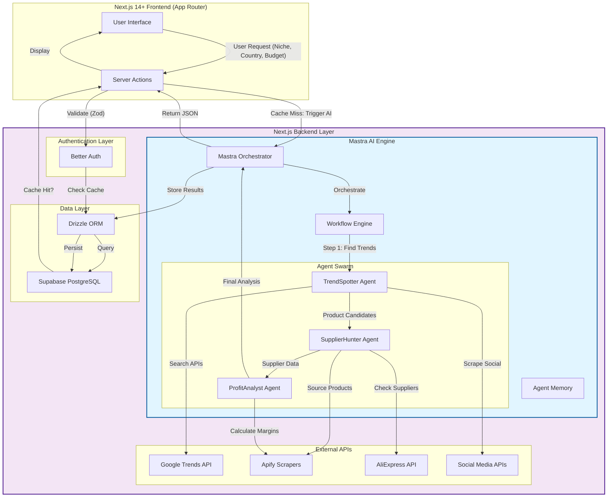
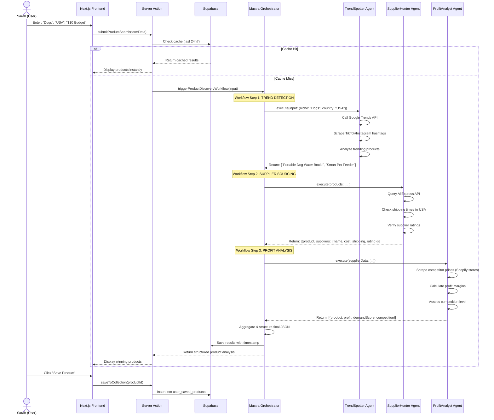
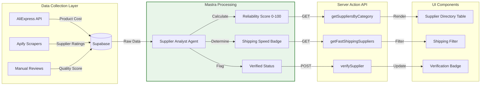
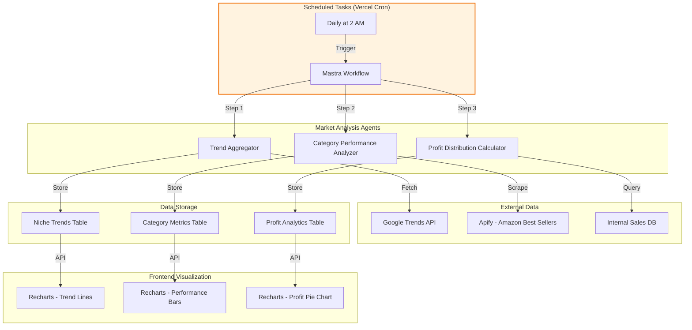
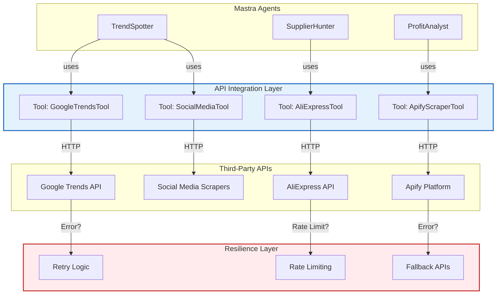
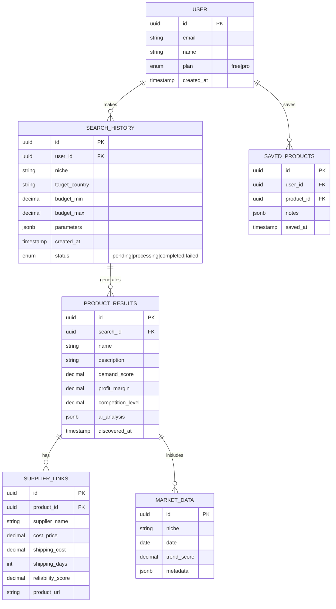
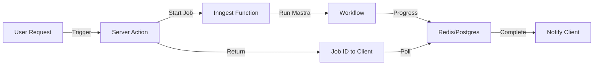
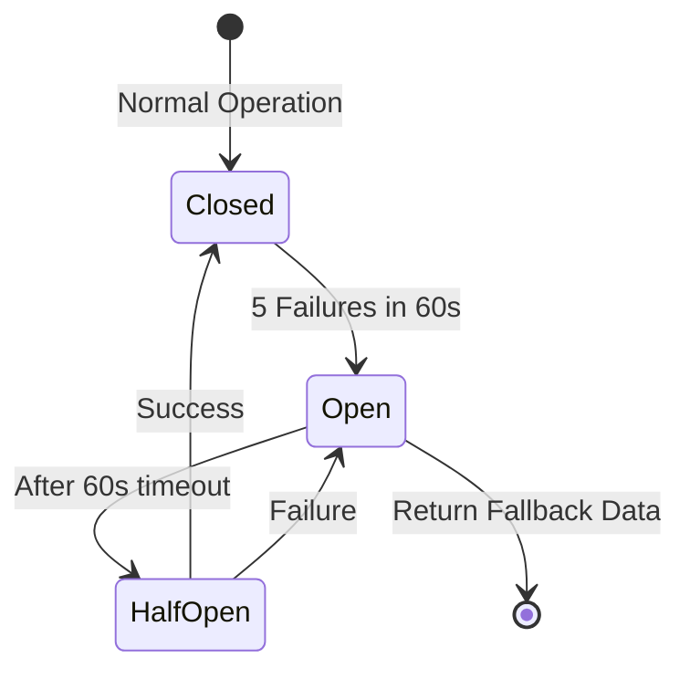

# 🚀 DropAI Backend Implementation Guide

## Executive Summary

DropAI is an AI-powered dropshipping intelligence platform. This guide outlines the backend architecture using **Mastra** (TypeScript AI framework) instead of CrewAI, providing a modern, type-safe alternative for building multi-agent workflows.

---

## 1. System Architecture Overview

### High-Level Data Flow



### Why This Architecture?

| Component | Purpose | Benefit |
|-----------|---------|---------|
| **Next.js App Router** | Full-stack framework | Unified frontend/backend, Server Actions, streaming |
| **Mastra** | AI orchestration | TypeScript-native, Vercel AI SDK integration, durable workflows |
| **Supabase + Drizzle** | Database | Type-safe SQL, PostgreSQL power, real-time subscriptions |
| **Better Auth** | Authentication | Framework-agnostic, lightweight, secure |
| **Server Actions** | API layer | No separate REST API needed, automatic type safety |
| **Zod** | Validation | Runtime type safety, perfect for AI output parsing |

---

## 2. Feature Roadmap & Implementation Logic

### 2.1 Core Feature: AI Product Discovery Workflow

This is the heart of DropAI. Here's how the **Mastra-powered** multi-agent system works:

#### Step-by-Step Workflow



#### How Mastra Replaces CrewAI

Instead of Python-based CrewAI, we use **Mastra's TypeScript-native** approach:

| CrewAI Concept | Mastra Equivalent | Implementation |
|----------------|-------------------|----------------|
| **Crew** | **Workflow Engine** | `mastra.workflow()` with `.step()` chaining |
| **Agent** | **Agent** | `mastra.agent()` with tools and instructions |
| **Task** | **Step** | Individual workflow steps with input/output schemas |
| **Process** | **Orchestration** | Sequential, parallel, or conditional branching |

---

### 2.2 Feature: Supplier Intelligence System



---

### 2.3 Feature: Market Intelligence & Reporting



---

## 3. API Strategy & Third-Party Integrations

### 3.1 Primary Data Sources

#### **A. Google Trends API (Official)**
- **URL**: [https://developers.google.com/trends](https://developers.google.com/trends) 
- **Status**: Alpha (limited access, approval required) 
- **Purpose**: Validate product demand using real search volume data

**How It Works in DropAI:**
1. **User Input**: Sarah searches for "Dogs" niche
2. **Backend Call**: TrendSpotter Agent calls Google Trends API with parameters:
   - `keyword`: "portable dog water bottle"
   - `geo`: "US"
   - `timeframe`: "today 1-m"
3. **What It Returns**: Interest over time (0-100 scale), related queries, trending topics
4. **Processing**: Mastra agent converts relative interest to demand score (0-100)
5. **User Benefit**: Sarah sees "Demand Score: 85/100 (Trending Upward)"

**Fallback Strategy**: If official API is unavailable, use **Glimpse API**  or **ScrapingBee**  for unofficial Google Trends data.

---

#### **B. Apify - E-commerce Scraping Tool**
- **URL**: [https://apify.com/apify/e-commerce-scraping-tool](https://apify.com/apify/e-commerce-scraping-tool) 
- **Purpose**: Scrape competitor prices, product details, and supplier information from ANY e-commerce site

**How It Works in DropAI:**
1. **Scenario**: ProfitAnalyst Agent needs to check competitor pricing for "Portable Dog Water Bottle"
2. **Backend Action**: 
   - Agent identifies 5 Shopify stores selling similar products via Google Search
   - Calls Apify API with store URLs
3. **What It Returns**: 
   ```json
   {
     "product": {
       "title": "Portable Dog Water Bottle 500ml",
       "price": "$24.99",
       "currency": "USD",
       "availability": "In Stock"
     },
     "sellers": [...]
   }
   ```
4. **Processing**: Agent calculates average market price ($24.00) vs. wholesale cost ($4.00)
5. **User Benefit**: Sarah sees "Competitors sell at $24.00 | Your potential profit: $20.00 (83% margin)"

**Key Features Used**:
- Proxy rotation (avoid blocks)
- JavaScript rendering (for dynamic Shopify stores)
- Scheduled runs (track price changes over time) 

---

#### **C. AliExpress API (RapidAPI)**
- **URL**: [https://rapidapi.com/category/Shopping](https://rapidapi.com/category/Shopping) (Search for AliExpress APIs)
- **Purpose**: Real-time supplier data, pricing, and shipping information

**How It Works in DropAI:**
1. **Scenario**: SupplierHunter Agent needs to source "Portable Dog Water Bottle"
2. **Backend Action**:
   - Calls AliExpress API with search term
   - Filters by: price <$10, shipping to USA, rating >4.5
3. **What It Returns**:
   ```json
   {
     "product_id": "12345",
     "title": "500ml Portable Pet Water Bottle",
     "price": 3.99,
     "shipping_cost": 2.50,
     "shipping_days": 7,
     "supplier_rating": 4.8,
     "supplier_name": "PetGadgets Store",
     "order_count": 15420
   }
   ```
4. **Processing**: Agent validates supplier reliability, calculates total landed cost
5. **User Benefit**: Sarah sees "3 Suppliers Found | Best Price: $4.00 | Ships in 7 days"

---

#### **D. Social Media Trend APIs (TikTok/Instagram)**
- **TikTok Research API**: [https://developers.tiktok.com/](https://developers.tiktok.com/) (Official, requires approval)
- **Alternative**: **ScrapingBee** or **Apify TikTok Scraper** 

**How It Works in DropAI:**
1. **Scenario**: TrendSpotter Agent checks if "Portable Dog Water Bottle" is viral
2. **Backend Action**:
   - Scrapes TikTok for hashtag #dogaccessories
   - Counts video views, likes, and engagement rate
   - Identifies influencer mentions
3. **What It Returns**: Viral coefficient score, trending hashtags, creator sentiment
4. **Processing**: Agent combines with Google Trends for "Social Proof Score"
5. **User Benefit**: Sarah sees "🔥 Trending on TikTok: 2.5M views this week"

---

### 3.2 API Integration Architecture



---

## 4. Database Schema Design (Drizzle ORM)

### Core Tables



---

## 5. Implementation Patterns & Code Structure

### 5.1 Project Structure

```
dropai/
├── app/                          # Next.js App Router
│   ├── api/                      # API routes (if needed)
│   ├── dashboard/
│   │   ├── finder/
│   │   │   └── page.tsx          # Product finder UI
│   │   └── results/
│   │       └── page.tsx          # Results display
│   └── actions/                  # Server Actions
│       ├── product-search.ts     # Main search action
│       ├── save-product.ts       # Save to collection
│       └── supplier-queries.ts   # Supplier data
├── lib/
│   ├── mastra/                   # AI Engine
│   │   ├── index.ts              # Mastra initialization
│   │   ├── agents/               # Agent definitions
│   │   │   ├── trend-spotter.ts
│   │   │   ├── supplier-hunter.ts
│   │   │   └── profit-analyst.ts
│   │   ├── workflows/            # Workflow definitions
│   │   │   └── product-discovery.ts
│   │   └── tools/                # API tools
│   │       ├── google-trends.ts
│   │       ├── apify-scraper.ts
│   │       └── aliexpress.ts
│   ├── db/                       # Database
│   │   ├── schema.ts             # Drizzle schema
│   │   ├── index.ts              # Connection
│   │   └── queries.ts            # Type-safe queries
│   └── auth.ts                   # Better Auth config
├── types/
│   └── index.ts                  # Shared TypeScript types
└── validations/
    └── schemas.ts                # Zod schemas
```

### 5.2 Mastra Workflow Example (Conceptual)

```typescript
// lib/mastra/workflows/product-discovery.ts

import { mastra } from '../index';
import { z } from 'zod';

// Define workflow input schema
const discoveryInputSchema = z.object({
  niche: z.string(),
  country: z.string(),
  maxBudget: z.number(),
});

export const productDiscoveryWorkflow = mastra.workflow({
  name: 'product-discovery',
  triggerSchema: discoveryInputSchema,
  
  steps: [
    // Step 1: Trend Spotting
    {
      id: 'find-trends',
      execute: async ({ input, agents }) => {
        const trendSpotter = agents.get('trendSpotter');
        const trends = await trendSpotter.execute({
          prompt: `Find trending products in ${input.niche} for ${input.country}`,
        });
        return { productCandidates: trends.products };
      },
    },
    
    // Step 2: Supplier Sourcing (depends on step 1)
    {
      id: 'source-suppliers',
      execute: async ({ input, prevResults, agents }) => {
        const supplierHunter = agents.get('supplierHunter');
        const products = prevResults['find-trends'].productCandidates;
        
        const sourced = await Promise.all(
          products.map(p => supplierHunter.execute({
            prompt: `Find suppliers for ${p.name} under $${input.maxBudget}`,
          }))
        );
        return { sourcedProducts: sourced };
      },
    },
    
    // Step 3: Profit Analysis (depends on step 2)
    {
      id: 'analyze-profit',
      execute: async ({ prevResults, agents }) => {
        const profitAnalyst = agents.get('profitAnalyst');
        const products = prevResults['source-suppliers'].sourcedProducts;
        
        const analysis = await profitAnalyst.execute({
          prompt: `Calculate profit margins and competition for: ${JSON.stringify(products)}`,
        });
        return { finalResults: analysis };
      },
    },
  ],
});
```

---

## 6. Must-Have Tools & Scalability Recommendations

### 6.1 Critical Additions to Your Stack

| Tool/Service | Purpose | Why Essential |
|--------------|---------|---------------|
| **BullMQ** or **Inngest** | Background job processing | Mastra workflows can take 30-60 seconds. Process asynchronously, notify user when done. |
| **Vercel AI SDK** | Streaming UI | Already in your stack. Use for real-time agent status updates ("Scanning trends..."). |
| **Upstash Kafka** or **Vercel Postgres** | Event streaming | Track agent execution events, retry failed steps. |
| **Helicone** or **Langfuse** | AI Observability | Track Mastra agent costs, latency, and success rates. |
| **Resend** | Transactional email | Notify Sarah when her product research is complete. |

### 6.2 Architectural Patterns

#### **Pattern 1: Durable Execution**
Since Mastra workflows involve multiple API calls (potentially 30-60 seconds), use **Vercel's `unstable_after`** or **Inngest** for durable execution:



#### **Pattern 2: Idempotency**
Prevent duplicate AI processing for identical searches:

```typescript
// Server Action pseudo-code
export async function searchProducts(input: SearchInput) {
  // 1. Create hash of input parameters
  const cacheKey = hash(input);
  
  // 2. Check Supabase for recent result (24h)
  const cached = await db.query.searchHistory.findFirst({
    where: eq(searchHistory.cacheKey, cacheKey),
    where: gt(searchHistory.createdAt, new Date(Date.now() - 24*60*60*1000))
  });
  
  if (cached) return cached.results; // Instant return
  
  // 3. Trigger new Mastra workflow
  const job = await inngest.send({
    name: 'product.discovery',
    data: { ...input, cacheKey }
  });
  
  return { jobId: job.id, status: 'processing' };
}
```

#### **Pattern 3: Circuit Breaker**
Protect against API failures (e.g., AliExpress down):



### 6.3 Cost Optimization (No Redis Cache)

Since you're not using Redis, implement **application-level caching** in Supabase:

```sql
-- Create a cache table in Supabase
CREATE TABLE api_cache (
  key TEXT PRIMARY KEY,
  data JSONB,
  expires_at TIMESTAMP,
  created_at DEFAULT now()
);

-- Auto-cleanup expired entries
CREATE OR REPLACE FUNCTION cleanup_cache() RETURNS void AS $$
BEGIN
  DELETE FROM api_cache WHERE expires_at < now();
END;
$$ LANGUAGE plpgsql;
```

---

## 7. Security & Performance Considerations

### 7.1 Security Checklist

- **API Key Rotation**: Store all API keys in Vercel Environment Variables, rotate monthly
- **Rate Limiting**: Implement per-user rate limits on Server Actions (using `@upstash/ratelimit` or similar)
- **Input Sanitization**: Zod validation on all inputs before Mastra processing
- **SQL Injection Prevention**: Drizzle ORM handles this, but never use raw SQL with user input
- **AI Output Validation**: Validate Mastra agent outputs with Zod before database insertion

### 7.2 Performance Targets

| Metric | Target | Implementation |
|--------|--------|----------------|
| **Cached Search** | <500ms | Supabase query with indexed cache key |
| **New Search Init** | <2s | Async job creation, immediate response |
| **Full AI Workflow** | <60s | Parallel API calls where possible |
| **Dashboard Load** | <1s | Incremental Static Regeneration for reports |

---

## 8. Summary: Why This Architecture Wins

1. **Type Safety End-to-End**: TypeScript from frontend → Mastra agents → Database (Drizzle)
2. **Modern AI Orchestration**: Mastra provides durable workflows, memory, and tracing without Python complexity
3. **Serverless-First**: Runs entirely on Vercel, scales automatically, pay-per-use
4. **No Infrastructure Debt**: No Redis, no Kubernetes, no complex DevOps
5. **Rapid Development**: Server Actions eliminate API boilerplate, Mastra handles AI complexity

This architecture gives Sarah (your user) a magical experience: she enters "Dogs" and gets a complete business intelligence report in under a minute, while you maintain a clean, type-safe, scalable codebase.